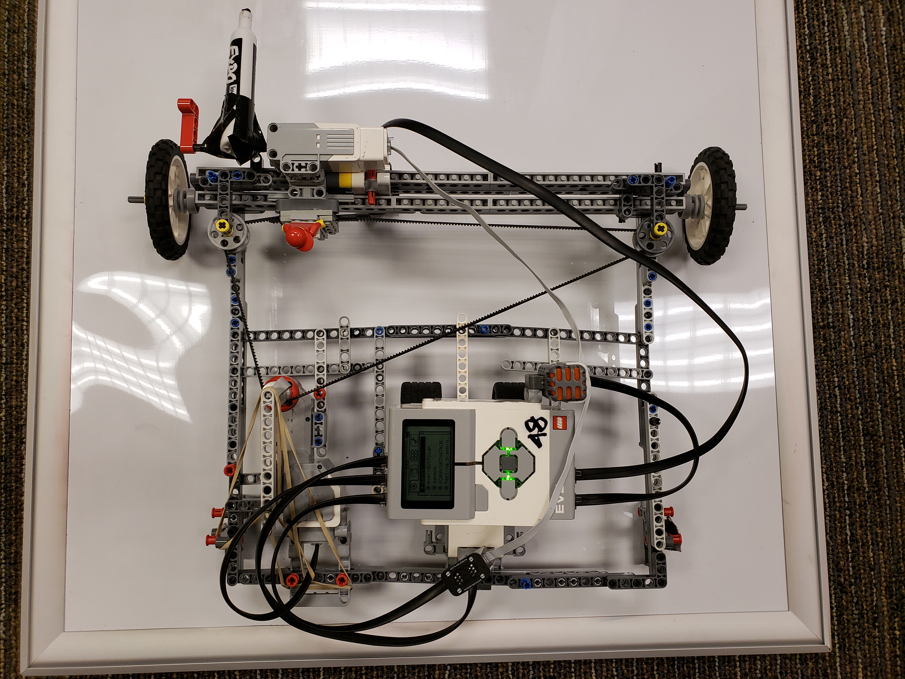
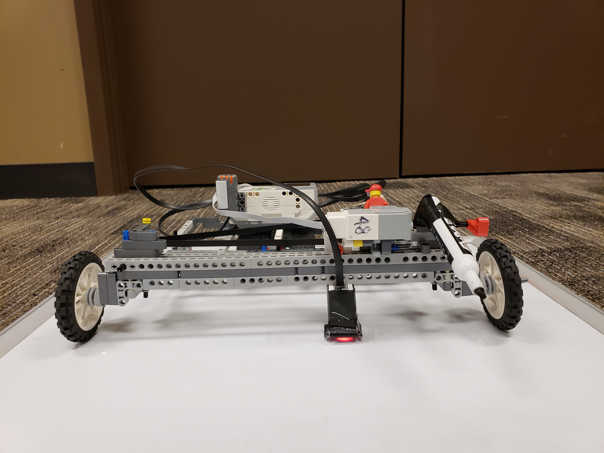
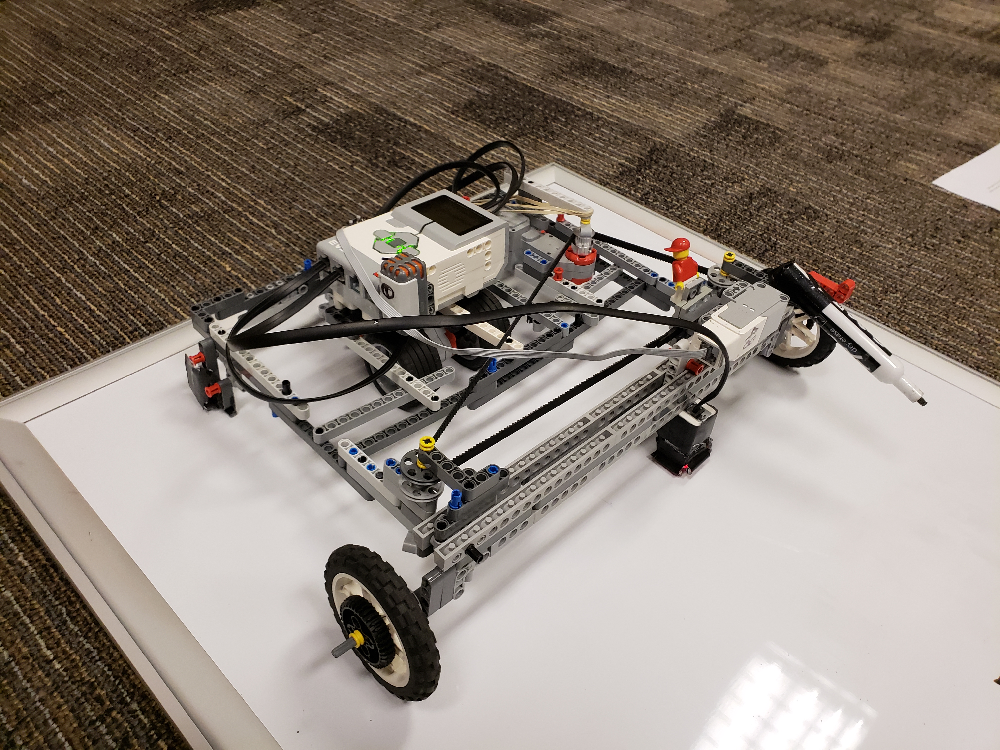
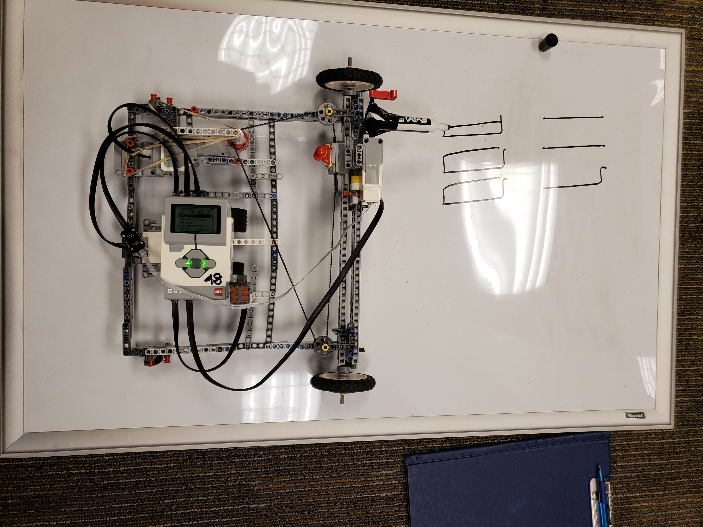
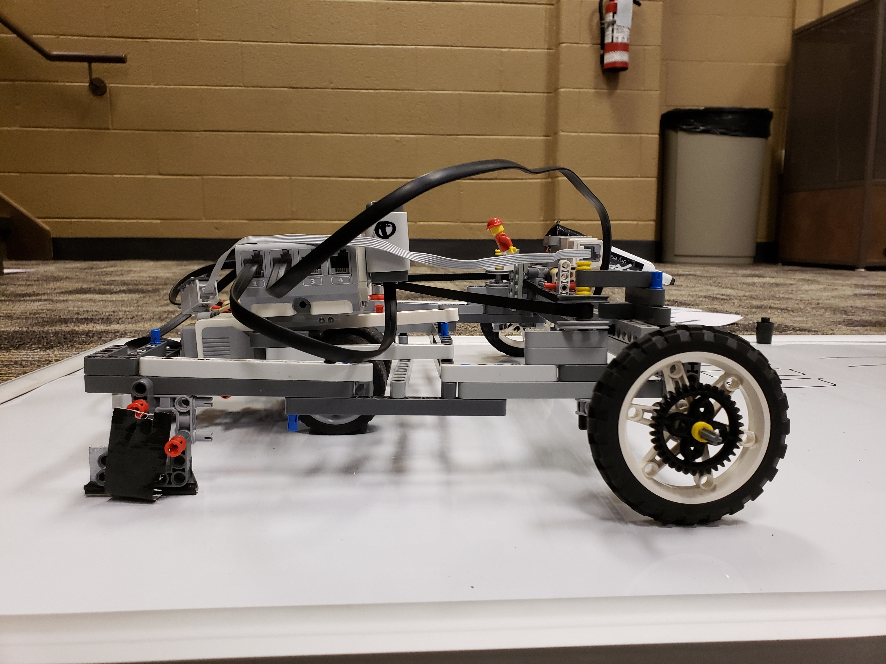
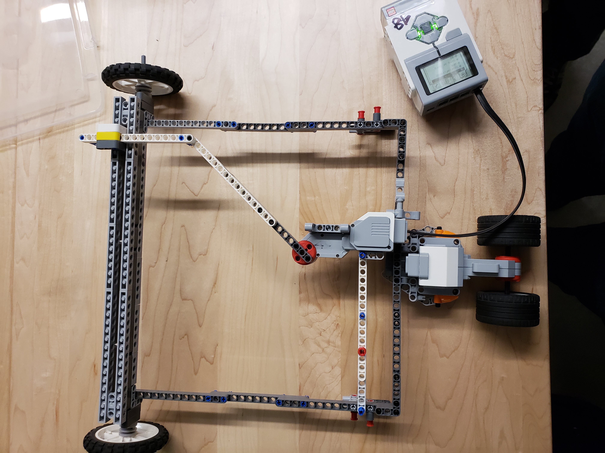

# RREF Robot

This is a repository for our `MTE 121 - Digital Computation ` course final project.

Our project aimed to create a mechatronic system which would assist students in building the fundamental skills required to learn linear algebra: solving matrices.

It is a robot that uses a color sensor to scan a page containing a printed 2x3 matrix.

The robot recognizes digits in the scan using `Hamming Distance` and performs a Gauss-Jordan reduction algorithm.

Finally, the robot draws the RREF solution onto a whiteboard.

## Youtube Video.
- [Scanning Demo](https://youtu.be/n-IVHIwxSUk)
- [Writing Demo](https://youtu.be/W1C-YbuWPNc)

## Images

## Version 1 
First version of arm mechanism

